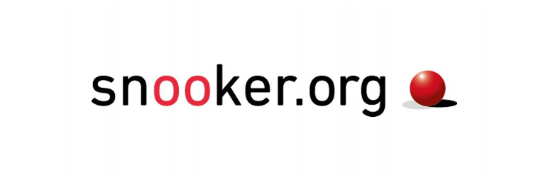

# WP Snooker API Plugin

A WordPress plugin that fetches snooker match data (previous, current, upcoming) from [Snooker.org](https://www.snooker.org) using a custom API key provided via the required `X-Requested-By` header. It includes caching mechanisms and tabbed display of match content on the frontend.

This plugin is created with support of [ChatGPT](https://github.com/openai), and it saved me many hours of coding.

---

## ✅ Features

- Fetches and displays Snooker.org data (Previous, Current, Upcoming matches)
- Tab-based interface with smooth transitions
- Caching layer using WordPress transients
- Manual AJAX refresh after defined intervals (e.g. every 10 minutes)
- Lightweight and customizable frontend design
- Admin panel to manage plugin settings (API Key, cache clearing, etc.)

---

## 🧰 Installation

1. Upload the plugin folder to `/wp-content/plugins/wp-snooker-api-plugin/`  
   or install via the **WordPress Plugin Admin** (`Plugins → Add New → Upload Plugin`)
2. Activate the plugin through the **‘Plugins’** menu in WordPress.
3. Navigate to **Snooker API Settings** in the admin menu.
4. Enter the required **Header Value (X-Requested-By)**.  
   > You must request this value by contacting: `webmaster@snooker.org`
5. Save your changes.
6. Add the shortcode `[snooker_org_plugin]` to any post or page.

---

## 🧩 Display & Layout Notes

- The plugin displays content in three tabs: **Previous Matches**, **Current Matches**, and **Upcoming Matches**.
- Data is fetched from the Snooker.org API and cached every 10 minutes.
- AJAX refresh of tab content is automatically triggered after 10 minutes of page load.

### 🧱 Flexible Plugin Box Height

The height of the plugin box is **dynamically adjusted** based on the content shown. This means the height will **expand or contract** depending on the amount of match data returned for each tab.

---

## 🔄 Cache & Performance

- The plugin uses WordPress transients for short-term caching (default: 10 minutes).
- You can manually clear the plugin cache using the **Clear Cache** button in the admin settings.

---

## 🆘 Troubleshooting

### Invalid or Missing `X-Requested-By` Header

If you notice that the plugin displays no data or shows a placeholder even after setup, it might be due to an incorrect Header Value.

To resolve:

1. **Enter the correct Header Value (X-Requested-By)** in plugin settings.  
   > You can request it from: `webmaster@snooker.org`
2. **Click "Save Changes"** after entering the correct value.
3. **Clear the plugin cache** using the button in the plugin's admin page.
4. **Refresh the frontend page** where the plugin shortcode is used.

➡️ You can refer to the screenshot (`screenshot-4.png`) showing what this issue typically looks like.

---

## 📸 Screenshots

1. `screenshot-1.png` – Admin Settings Page
2. `screenshot-2.png` – Frontend: Previous Matches Tab
3. `screenshot-3.png` – Frontend: Current Matches Tab
4. `screenshot-4.png` – Example of error caused by invalid or missing `X-Requested-By` header

Place all screenshots in the `assets/` directory of the plugin when submitting to WordPress.org.

---

## 📄 License

This plugin is licensed under the [GNU General Public License v2 or later](https://www.gnu.org/licenses/gpl-2.0.html).

See the full license text in the [LICENSE.md](LICENSE.md) file included in this repository.

---

## 🧑‍💻 Authors

- Novak Urošević - [LinkedIn](https://www.linkedin.com/in/novak-urosevic/), [GitHub](https://github.com/novakurosevic)
- [ChatGPT](https://github.com/openai)

---

